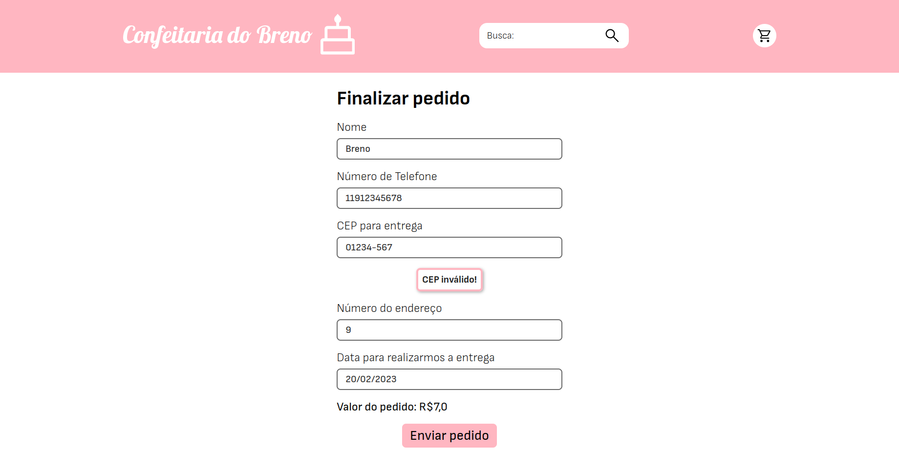

# Confeitaria do Breno

> Status: Concluído

Uma confeitaria online desenvolvida em **Django** com SQLite3.

## Detalhes do projeto

A aplicação permite que usuários visualizem e façam buscas entre os produtos da confeitaria, os produtos podem ser adicionados ao carrinho do usuário usando sessões do Django. Depois de escolher os produtos, o usuário pode realizar o pedido sem a necessidade de fazer login ou cadastro, somente passando as informações pessoais, como endereço de entrega, telefone para contato e nome.

Após o pedido ser realizado, a equipe da confeitaria pode acessar a página de admin, que está mapeada para o hash 21232f297a57a5a743894a0e4a801fc3, para fazer a localização da página de admin menos previsível. Acessando a página de admin a equipe pode preparar o pedido adequadamente e realizar a entrega, então marcando o pedido como entregue. A equipe também pode adicionar novos produtos usando a página de admin.

## Páginas

### Página Inicial

Onde alguns produtos em destaque são exibidos na forma de carrossel, usando Swiper.js. Há também uma forma de filtrar os destaques por categoria.

### Busca

Página que mostra os resultados da busca que pode ser feita usando o campo que fica no header da aplicação.

### Detalhes

Mostra os detalhes de um produto específico, que pode ser acessado por um botão que fica nos cards da página inicial e de busca. Através dessa página de detalhes é possível adicionar um produto ao carrinho.

### Carrinho

Contém uma lista com todos os produtos que já foram adicionados no carrinho, sendo possível remover ou adicionar mais itens.

### Finalizar Pedido

Página com formulário das informações do cliente, como telefone de contato, nome, cep e número do endereço para entrega e data para entrega.

### Erro

Página para erros 500 e 404, que é renderizada somente em ambiente de produção, quando a opção DEBUG de settings.py está como False.

---
